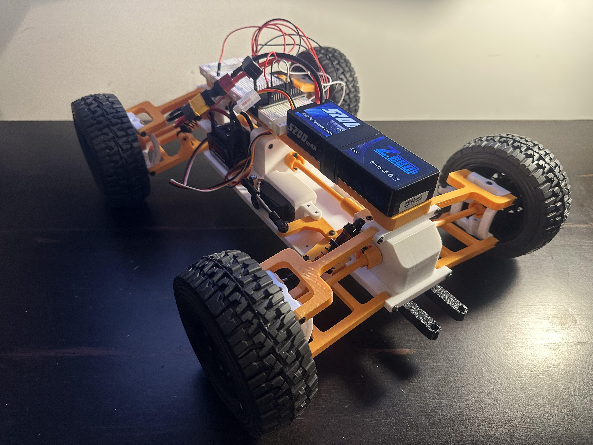

# spot_v1
An autonomous line-following pacer car designed to maintain a steady speed on the track for track and field training.
## Preview (WIP)

## Next Steps
- Setup PID steering
## License
This project is licensed under the MIT License - see the LICENSE file for details.
